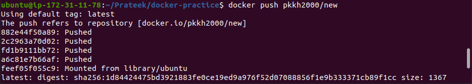
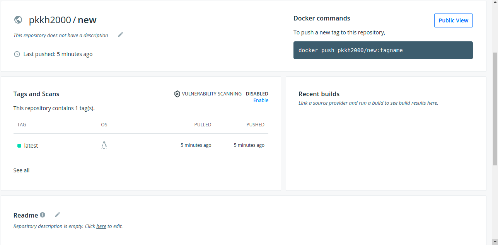

## DOCKER PUSH COMMANDS
```
docker tag image_name DockerHub_Username/New_image_name
docker login -u DockerHub_Username
docker push new_image_name
docker logout
```


## DOCKER PUSH COMMAND TO DOCKER HUB



## DOCKER HUB IAMGE DISPLAY

